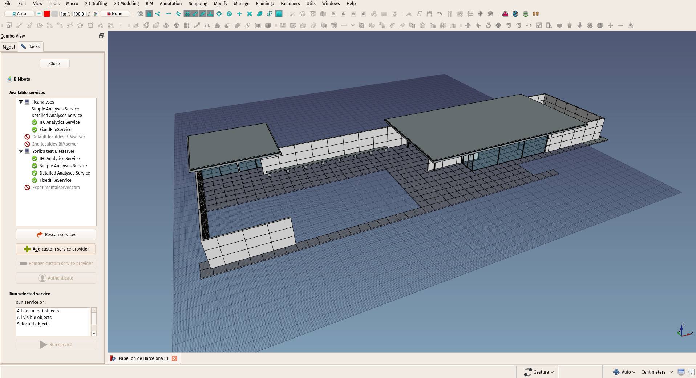
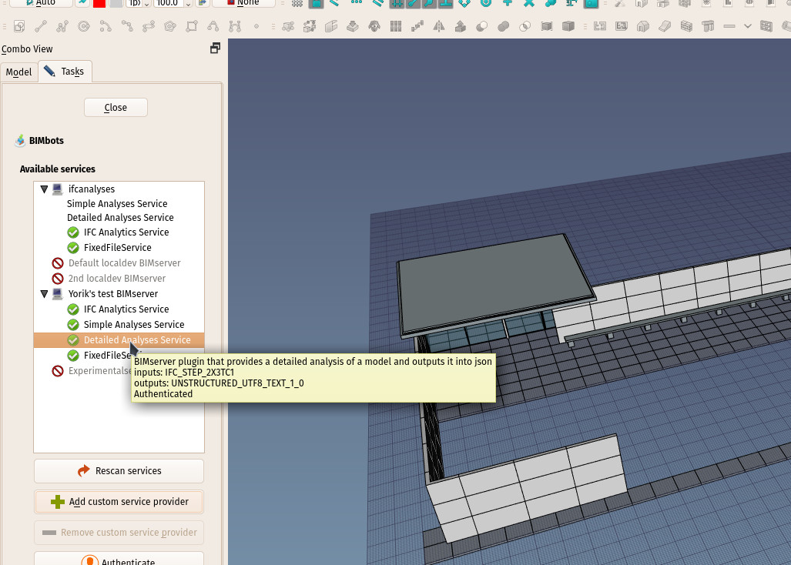
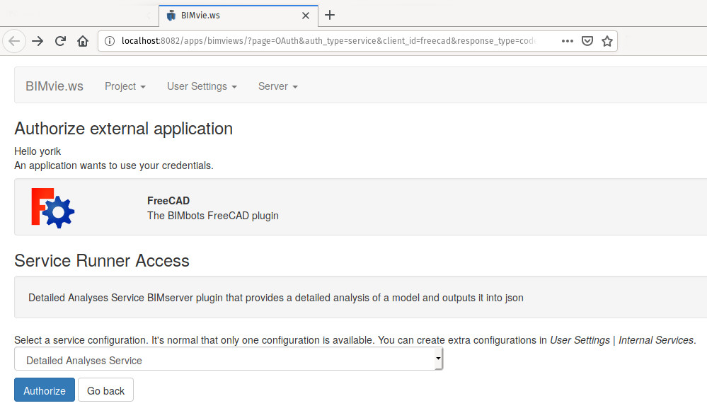

## BIMBots FreeCAD plugin documentation





The BIMBots plugin is an addon/macro for FreeCAD to to allow it to connect and use [BIMBots](http://bimbots.org/) services. BIMbots is an open-source system built on top of the [BIMServer](http://bimserver.org) project. In a nutshell, it allows an application to connect to a BIMServer instance, and use some of the services hosted on it on the fly, without the need to setup and upload a proper project to the server.

The BIMBots plugin can also be run from the command line, or imported as a python module(check the [API documentation](documentation.md)).

### Installing

**Note:** below method not yet available - At the moment, you need to manually clone the BIMBots repo under your FreeCAD's Mod folder. See the [README](../README.md) file for further instructions

The easiest way to install the BIMBots plugin is via the Add-ons Manager in FreeCAD, found under menu **Tools -> Addon Manager**. Locate the BIMBots add-on in the list, click "install", restart FreeCAD.

If you also have the **BIM Workbench** add-on installed, a BIMbots entry will appear under menu **Utils** inside the BIM Workbench. If not, you'll be able to use the BIMBots macro from the Macros dialog under menu **Macro -> Macros...**. It is also possible to create a toolbar button from any installed macro. Refer to the [FreeCAD documentation](https://www.freecadweb.org/wiki/Customize_Toolbars) to do that.

### Usage

Upon launching the BIMBots macro, a panel opens in the Tasks area of FreeCAD, as shown in the image above, and the plugins immediately downloads a list of available servers from the [official BIMbots repository list](https://raw.githubusercontent.com/opensourceBIM/BIMserver-Repository/master/serviceproviders.json). This list is maintained by the BIMServer project and lists common addresses where BIMBots services can be found. If you have a BIMServer instance running locally on the default port, it will be autodetected here.

The list of servers and their available services will be shown on the BIMBots panel. Hovering the mouse over a service displays additional information such as which format it accepts and delivers:




#### Managing servers and services

Pressing the **Rescan services** button will open a sub-panel showing a couple of options:


* **Auto-discover new services**: Queries the servers from the [official BIMbots repository list](https://raw.githubusercontent.com/opensourceBIM/BIMserver-Repository/master/serviceproviders.json) for services. Otherwise, only lists the servers that have been manually added (see below)
* **Show unreachable providers**: Displays the servers that are present in the official list, or that have been manually, but that cannot be reached or don't provide a list of BIMBots services. Otherwise, these unavailable servers won't be shown
* **Filter by category**: For future use, as BIMBots services can implement categories
* **Max price**: For future use, as paid BIMBots services can exist
* **Scan**: Updates the services list according to the above criteria
* **Cancel**: Closes this sub-panel


You can add custom BIMServer instances, or any other BIMBots provider that you have access to and know the URL, by pressing the **Add custom service provider** button, which opens another sub-panel:


* **Name**: A custom name for the new server
* **URL**: The server URL. BIMBots server URLs usually end with /servicelist which is the entry point where the server can be queried for available services. Here, you can put either the "pure" server URL (ex. http://www.myserver.com) or add the /servicelist (ex. http://www.myserver.com/servicelist). Even if you don't, both will be tested for service entry point.
* **Add**: Adds the new server and rescans
* **Cancel**: Closes this sub-panel


You can remove any custom server you added this way by selecting it, then pressing the **Remove custom service provider** button. That button will only be enabled if you select a custom service provider. Service providers that were automatically added through the "Auto-discover new services" above cannot be removed. 


#### Authenticating

Before using a BIMBots service, you need to **authenticate** with that service. For that, you need to already have a user account on the server that provides the service. Authentication needs to happen only once. FreeCAD will remember authenticated services, and mark them with a green icon in the services list.

To authenticate with a service, select it and press the **Authenticate** button. A sub-panel will open, and, simultaneously, your web browser will open and show the authentication page of the service:




The "Select service configuration" drop-down list should contain at least one entry (usually only one). If it doesn't, and you are unable to authenticate, you might need to enable  this service from the same screen, under menu **User settings -> Internal services**.

After clicking the **Authorize** button, youwill be given a token and a service URL:


These two values need to be copied and pasted back into FreeCAD, into the sub-panel that opened when you pressed the **Authenticate** button:


* **Token**: The Token value obtained from the server web page above
* **Service URL**: The service address obtained from the server web page above
* **Save**: Saves the authentication values. This button will only be enabled when both fields are filled
* **Cancel**: Cancels the operation and closes this sub-panel

You can authenticate again with an already authenticated service, any number of times, by pressing the Authenticate button again.


#### Running services

Once you have authenticated with a service, you can run it on a FreeCAD model. You need to have a model already opened in FreeCAD, as the BIMBots plugin will act on the active document.

Note that no service will actually modify your model. They will only deliver a report. It is therefore totally safe to test them on any of your models.

BIMBots services can deliver many [data types](https://github.com/opensourceBIM/BIM-Bot-services/wiki/Schemas). The most common are JSON, simple text, or BCF files. JSON and text reports will be formatted and displayed to you upon receiving. BCF files get saved on your computer, but FreeCAD currently doesn't provide a way to visualise BCF files (this is being worked on). Hovering the mouse over a service will inform you of the type of data it will deliver.

To run a service, select an authenticated service, and one of the three options below:


* **All document objects**: Will send all objects from the current document to the BIMBots service. This is usually not what you want, as it will also include objects that are components of others, such as wall baselines or construction geometry. Use this option for testing purposes only.
* **All visible objects**: Will send all objects currently visible in the 3D view. This is a quick way to check your whole model without having to care about a proper model structure.
* **Selected objects**: This is usually the preferred option. If you select one or more container objects, such as groups, building parts, storeys, buildings or sites, all their contents will be added as well. If you are using a proper IFC-based model structure, you can usually only select the base site or building, and all the model contained in it will be sent together.
* **Run service**: Saves the model objects obtained by the selection method above to a temporary IFC file, and sends this file to the selected service. This button will only be enabled if both an authenticated service and a selection method are highlighted.


#### Reading service reports

If all went well, after a little time (depending on the size of your model), the plugin will receive a report and open a new panel to display the results:


The data contained in the report depends on the BIMBots service. If the report is made of JSON or Text data, a new panel opens to display its contents. Blue entries can be double-clicked, and the according object will be selected in the FreeCAD document. If an IFC type is double-clicked, such as IfcWall, all objects of that type found in the FreeCAD document will be selected.

If the report is a BCF file, that file is stored on your computer, and notifies you of the file location. At the moment, FreeCAD doesn't have support for visualising BCF files.

The **Run another service** button will close the report panel and go back to the previous screen.


#### Troubleshooting

* **Cannot authenticate**: If the server fails to give a token and service address, the most likely cause is that the service you are requesting wasn't enabled for your user. Services installed on a BIMServer need to be enabled by each user wishing to use them. That can be done in the same web page, under menu **User settings -> Internal services**.

* **Service returns "no response"**: The most common reason why a service couldn't be run is because there is a defect in your model that prevents it from being analysed. Try choosing the **Selected objects** option, and select only one simple object from your model, such as a wall or column. If that works, try repeating the operation selecting more objects, until identifying which objects are not accepted by the server.
* **Service still returns "no response"**: Another reason why the server might reject your file is because the appropriate deserializer is not enabled for your user. Try accessing the server in a web browser (it can be done by pressing the "Authenticate" button as described above, navigate to  menu **User settings -> Deserializers**, and add both Ifc2x3 and Ifc4 step deserializers.
* **Still "no response"**: Try the debug options below.
* **Debug options**: The BIMBots plugin can be made to display additional testing options to the list above, that can be useful to test if you suspect the plugin is not working correctly. To enable debug options, close the BIMBots plugin, and enter the following code in the FreeCAD Python console (found in FreeCAD under menu **View -> Panels**):

```
import bimbots
bimbots.DEBUG = True
bimbots.launchUI()
```

The BIMBots panel will be shown again, like upon normal use. However, additional options will be present in the object selection section:

* **Choose IFC file**: This allows you to send an existing IFC file already present on your machine instead of the contents of the active FreeCAD document. Use this to test a service with a file that is known to work with the given BIMServer.
* **Test payload**: This option will send a minimal IFC file that is guaranteed to work with any server. If this test fails, then there is likely a problem on the server that provides the service, or with your internet connection.
* **Test output only**: This option doesn't send any data to any service, but opens the results panel and fills it with dummy result data. Try this if you suspect that the BIMBots interface is not working correctly.